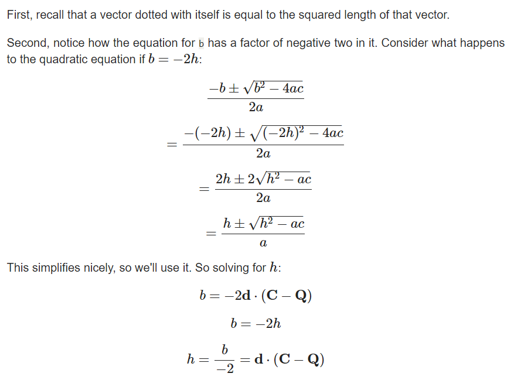

Oscar Lavolet 20242868

# Raytracer
This project has been done in the IFT3355 class, it should support every feature mentionned [here](a24_ift3355_tp2.pdf).

Ideally, the project is expanded to be a raytracing game engine for small games to be developped with a friend, see [this]() or [that]() as ideas that could be implemented in the future


## Notes about the code
_PLEASE READ THIS BEFORE CORRECTING_

It is now common among developpers to use AI to code and the AI often uses commentary on the code to have the developper understand the program. 

However, I tend to also use commentaries to ease the understanding of my code for myself and any other person coming into the project, which could potentially be misinterpreted as blatant AI usage. Please consider this when correcting.


## trashed code


Quad intersection
``` c++
bool Quad::local_intersect(Ray ray, double t_min, double t_max, Intersection *hit) {
    // Define the plane for the quad with Ax + By + Cz = D
    double D = dot(center, normal);

    // Check if the ray is parallel to the plane
    double denominator = dot(normal, ray.direction);
    if (std::abs(denominator) < EPSILON) {
        return false;
    }

    // Calculate the intersection distance `t`
    double t = (D - dot(normal, ray.origin)) / denominator;

    // Ensure `t` is within the bounds
    if (t < t_min || t > t_max) {
        return false;
    }
    // Find the intersection point
    double3 intersection = ray.origin + t * ray.direction;
    double3 plane_hit_point = intersection - center;
    //double3 local_intersection = mul(i_transform, double4(intersection, 1.0)).xyz();

    // Calculate parameters `a` and `b` for the local intersection point

    // currently testing a and b
    double a = dot(w, cross(plane_hit_point, v));
    double b = dot(w, cross(u, plane_hit_point));


    // Check if `a` and `b` are within [0, 1] to confirm the intersection lies within the quad
    if (a < 0 || a > 1 || b < 0 || b > 1) {
        return false;
    }

    // Populate the hit information
    hit->uv = double2(a, b);
    hit->normal = dot(ray.direction, normal) < 0 ? normal : -normal;
    hit->depth = t;
    hit->position = intersection;

    return true;
}
```


### advancements and important parts
#### functionnal
 - Camera 
 - sphere intersection

#### Done ?
 - jittery camera
 - Naive intersection
 - sphere collision and AABB definition
 - quad intersection and AABB definition

#### Left to do 
 - Cylinder collision and AABB definition
 - mesh collision and AABB definition
 - AABB 
    - retrieve corners
    - construct aabb
    - compute aabb
    - intersect
 - BVH
 - Shading
    - eclairage local
    - eclairage local 
    - ombres
    - Reflexion
        - reflection mirroir
        - refraction
    - Textures
        - UV mapping
        - Couleur
 - DOF

## Important to understand the code

### Sphere intersection
The formula with "h" coming from the [raytracing in one weekend](https://raytracing.github.io/books/RayTracingInOneWeekend.html) :



## trucs a faire gaffe 

    shadow acne -> solved by slightly moving normal vector towards the surface
